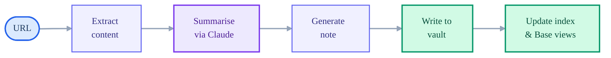
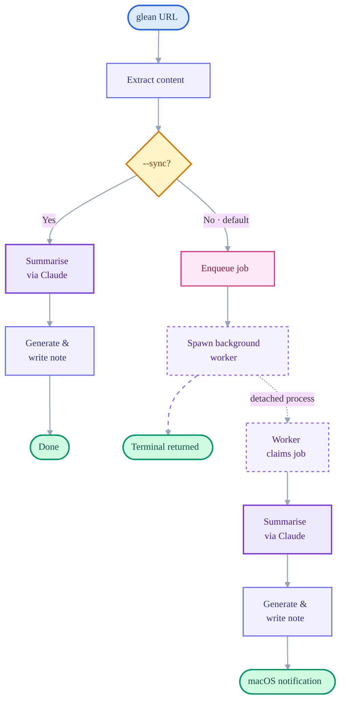
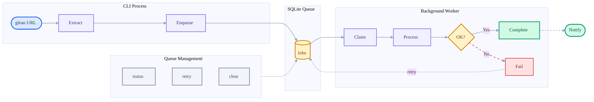

# Glean

Capture web articles as rich Obsidian notes with AI-generated summaries.

[](https://github.com/kiyanwang/glean/actions/workflows/ci.yml)

## Overview

Glean is a Node.js CLI tool that transforms a URL into a fully catalogued knowledge entry in a single command. It extracts web article content, generates structured AI summaries via Claude, and stores the result as a rich Obsidian note with YAML frontmatter and a searchable Base view.

### Core Pipeline



### Async vs Sync Execution

By default, Glean runs in **async mode** — content extraction happens in the foreground (1-3 seconds), then summarisation is handed off to a background worker. Use `--sync` to wait for the full pipeline inline.



### Queue & Worker Architecture

The durable SQLite-backed queue survives crashes, laptop sleep, and retries failed jobs automatically.



## Features

- **Structured AI summaries** -- generates a concise summary, key takeaways, topic tags, and category classification using Claude
- **YAML frontmatter** -- every note includes full metadata (title, author, source, dates, reading time, word count, language, topics, tags)
- **Obsidian Base views** -- ships a `.base` file with four pre-configured views: All Articles, By Category, Recent, and Cards
- **Update / re-glean** -- refresh an existing note with `--update` while preserving the original capture date and any manually added tags
- **Dry-run mode** -- preview the generated note without writing to disk
- **JSON output** -- emit structured data as JSON for integration with other tools
- **Async by default** -- summarisation runs in a detached background worker, returning control to your terminal in 1-3 seconds with a macOS notification when the note is ready
- **Job queue** -- durable SQLite-backed queue survives crashes, laptop sleep, and retries failed jobs automatically
- **Tweet sharing** -- generate a tweet-length summary and open a pre-filled Twitter/X compose URL with `--tweet`
- **Configurable** -- defaults for vault, folder, tags, model, and categories via `~/.gleanrc.json`

## Prerequisites

| Dependency | Purpose | Notes |
|------------|---------|-------|
| [Node.js](https://nodejs.org/) >= 22 | Runtime | Required |
| [Claude CLI](https://claude.ai/download) | AI summarisation | Must be installed and authenticated |
| [Obsidian](https://obsidian.md/) | Viewing notes | Optional -- Glean writes directly to the vault folder on disk; Obsidian is only needed to browse and search the notes |

## Installation

```bash
git clone https://github.com/kiyanwang/glean.git
cd glean
npm install
npm link  # makes 'glean' available globally
```

## Configuration

Glean reads its configuration from `~/.gleanrc.json`. Copy the example file to get started:

```bash
cp .gleanrc.json.example ~/.gleanrc.json
```

Example configuration:

```json
{
  "vault": "Knowledge Base",
  "vaultPath": "/Users/you/Documents/Knowledge Base",
  "folder": "Glean",
  "defaultTags": ["glean"],
  "model": "haiku",
  "categories": [
    "engineering-management",
    "tools-and-libraries",
    "ai",
    "software-engineering",
    "leadership",
    "devops",
    "architecture",
    "career",
    "other"
  ]
}
```

| Field | Required | Description |
|-------|----------|-------------|
| `vault` | No | Obsidian vault name (used when opening notes with `--open`) |
| `vaultPath` | Yes | Absolute path to the vault folder on disk. Required for writing notes. |
| `folder` | No | Subfolder within the vault where notes are stored. Defaults to `Glean`. |
| `defaultTags` | No | Tags applied to every note. Defaults to `["glean"]`. |
| `model` | No | Claude model to use for summarisation (`haiku`, `sonnet`, `opus`). Defaults to `haiku`. |
| `dbPath` | No | Path to the SQLite queue database. Defaults to `~/.glean/glean.db`. |
| `categories` | No | Allowed category values for classification. Defaults to the list shown above. |

## Usage

```
Usage: glean [options] [command] <url>

Capture web articles as rich Obsidian notes with AI summaries

Arguments:
  url                   URL of the article to glean

Options:
  -V, --version         output the version number
  --vault <name>        Target Obsidian vault
  --vault-path <path>   Absolute path to vault directory
  --folder <path>       Folder within vault for notes
  --category <cat>      Override auto-detected category
  --tags <tags>         Additional tags (comma-separated)
  --open                Open the note in Obsidian after creation (default: false)
  --update              Re-glean a previously saved URL (default: false)
  --dry-run             Print the generated note without saving (default: false)
  --json                Output structured data as JSON (default: false)
  --model <model>       AI model for summarisation (haiku, sonnet, opus)
  --config <path>       Path to config file
  --sync                Run synchronously (wait for summarisation) (default: false)
  --tweet               Open a pre-filled tweet with the article summary (default: false)
  -h, --help            display help for command

Commands:
  status [job-id]       Show the queue status
  retry [job-id]        Retry failed job(s)
  clear                 Clear completed and failed jobs from the queue
```

### Async vs Sync Mode

By default, `glean <url>` extracts content in the foreground (1-3 seconds) and then enqueues the summarisation to a background worker. A macOS notification is sent when the note is ready.

Use `--sync` to wait for summarisation inline (the original behaviour):

```bash
glean https://example.com/article --sync
```

`--dry-run` and `--json` modes always run synchronously since they need immediate output.

### Examples

Basic usage (async -- returns immediately):

```bash
glean https://martinfowler.com/articles/platform-prerequisites.html
```

With options -- specify a vault, category, extra tags, and open the note in Obsidian afterwards:

```bash
glean https://example.com/article \
  --vault "Knowledge Base" \
  --category ai \
  --tags "llm,agents" \
  --open
```

Re-glean an article to refresh its summary (preserves the original capture date and any manually added tags):

```bash
glean https://example.com/article --update
```

Dry run to preview the generated note without writing anything to disk:

```bash
glean https://example.com/article --dry-run
```

Use a different model for higher-quality summaries (slower):

```bash
glean https://example.com/article --model sonnet
```

Output the structured data as JSON:

```bash
glean https://example.com/article --json
```

Share an article on Twitter/X with an AI-generated tweet:

```bash
glean https://example.com/article --tweet
```

This generates a ~170-character summary, appends the article URL, and opens the Twitter/X compose page in your browser. Works in both async (default) and sync modes. Combine with `--dry-run` to preview the tweet text without opening the browser:

```bash
glean https://example.com/article --tweet --dry-run
```

### Queue Management

Check the status of queued jobs:

```bash
glean status              # summary view
glean status <job-id>     # detail for a specific job
glean status --all        # full history
```

Retry failed jobs:

```bash
glean retry               # retry all failed jobs
glean retry <job-id>      # retry a specific job
```

Clear job history:

```bash
glean clear               # clear completed and failed jobs
glean clear --failed      # clear only failed jobs
glean clear --all         # clear ALL jobs (requires confirmation)
```

## Note Structure

Each gleaned article is saved as a Markdown file with YAML frontmatter:

```markdown
---
title: "Platform Prerequisites for Self-Service"
author: "Martin Fowler"
source: "martinfowler.com"
url: "https://martinfowler.com/articles/platform-prerequisites.html"
published: 2024-01-15
gleaned: 2026-03-11
updated: 2026-03-11
category: engineering-management
sentiment: informative
reading_time: 12
word_count: 3200
language: en
topics:
  - platform-engineering
  - developer-experience
  - self-service
tags:
  - glean
  - engineering-management
key_takeaways:
  - "Platform teams should focus on self-service capabilities"
  - "Documentation and golden paths reduce cognitive load"
  - "Measuring developer satisfaction is crucial"
---

## Summary

A concise 2-3 paragraph AI-generated summary of the article's main points.

## Key Takeaways

- Platform teams should focus on self-service capabilities
- Documentation and golden paths reduce cognitive load
- Measuring developer satisfaction is crucial

## Source

[Platform Prerequisites for Self-Service](https://martinfowler.com/articles/platform-prerequisites.html) by Martin Fowler on martinfowler.com
```

Notes are saved with a sanitised title as the filename (e.g., `Platform-Prerequisites-for-Self-Service.md`), truncated to 80 characters. Duplicate filenames receive a numeric suffix (`-2`, `-3`, etc.).

## Obsidian Base Views

Glean automatically deploys a `Glean.base` file into the notes folder, providing four pre-configured database views:

| View | Description |
|------|-------------|
| **All Articles** | Master table of every gleaned article with all metadata columns |
| **By Category** | Articles grouped by category for themed browsing |
| **Recent** | Articles gleaned in the last 30 days, limited to the 50 most recent |
| **Cards** | Visual card gallery showing title, author, source, category, and summary |

Open the `.base` file in Obsidian to browse, search, sort, and filter your article library.

## Development

### Running Tests

The test suite uses [Vitest](https://vitest.dev/) and runs without external dependencies (no network calls, no Obsidian, no Claude API).

```bash
npm test              # single run (used in CI)
npm run test:watch    # watch mode for development
npm run test:coverage # run with coverage report
```

### Project Structure

```
glean/
├── bin/
│   └── glean.js               # CLI entry point (--sync, status/retry/clear subcommands)
├── src/
│   ├── index.js               # Main orchestrator (glean, gleanAsync, spawnWorker)
│   ├── extract.js             # defuddle integration (content extraction)
│   ├── summarise.js           # Claude CLI integration (AI summarisation)
│   ├── note.js                # Markdown/YAML note generation
│   ├── store.js               # File writing, index management, update detection
│   ├── config.js              # Configuration loading
│   ├── utils.js               # Filename sanitisation, URL validation
│   ├── db.js                  # SQLite connection singleton (WAL mode, schema)
│   ├── queue.js               # Job queue operations (enqueue, claim, retry, clear)
│   ├── worker.js              # Background worker process (processes queue, sends notifications)
│   ├── tweet.js               # Tweet composition and browser intent helpers
│   └── commands/
│       ├── status.js           # glean status
│       ├── retry.js            # glean retry
│       └── clear.js            # glean clear
├── test/
│   ├── *.test.js              # Unit tests for each source module
│   ├── commands/
│   │   ├── status.test.js
│   │   ├── retry.test.js
│   │   └── clear.test.js
│   └── fixtures/              # Sample data for tests
├── .gleanrc.json.example      # Example configuration
├── package.json
└── vitest.config.js
```

### `~/.glean/` Directory

Created automatically at runtime. Contains:

| File | Purpose |
|------|---------|
| `glean.db` | SQLite database storing the job queue |
| `worker.pid` | PID file for the background worker (ephemeral) |

## License

MIT
