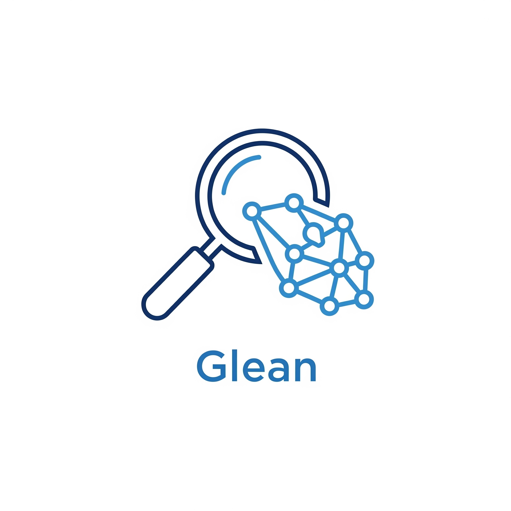

<p align="center">
  
</p>

<h1 align="center">Glean for Raycast</h1>

<p align="center">
  Capture web articles as Obsidian notes with AI summaries — directly from Raycast.
</p>

## Overview

This Raycast extension wraps the [Glean CLI](../README.md) so you can capture articles without opening a terminal. See a URL in your browser, invoke Raycast, type "glean", and it's queued for processing. A macOS notification arrives when the note is ready in your Obsidian vault.

The extension shells out to the `glean` binary rather than importing it as a library. This avoids native module compatibility issues with Raycast's Node.js runtime and means the extension always stays in sync with the CLI.

## Prerequisites

- [Raycast](https://raycast.com/) installed
- [Glean CLI](../README.md#installation) installed and configured (`~/.gleanrc.json`)
- [Raycast Browser Extension](https://www.raycast.com/browser-extension) (optional, for automatic URL detection from browser tabs)

## Installation

```bash
cd raycast-glean
npm install
npm run build
```

`npm run build` compiles and permanently registers the extension with Raycast — no background process needed. Only re-run after code changes.

For development with hot reload:

```bash
npm run dev
```

## Configuration

The extension has a single Raycast preference:

| Preference | Description | Default |
|------------|-------------|---------|
| **Glean Binary Path** | Absolute path to the `glean` binary | Empty (uses PATH) |

All other settings (vault path, folder, model, tags, categories) are read from `~/.gleanrc.json` — the same config file used by the CLI. See the [main README](../README.md#configuration) for details.

## Commands

### Glean URL

The primary command. Invoke Raycast, type "glean", press Enter.

**URL resolution priority:**
1. Text argument typed in the Raycast search bar
2. Active browser tab (via Raycast Browser Extension)
3. System clipboard contents

Content extraction runs in the foreground (1-3 seconds), then summarisation is handed off to a background worker. You'll see a "Queued: {title}" HUD confirmation, and a macOS notification when the note is ready.

### Glean URL (Advanced)

A form with per-URL overrides for when you need more control:

- **URL** — pre-filled from browser/clipboard
- **Category** — dropdown with all categories from your config, plus auto-detect
- **Additional Tags** — comma-separated
- **Model** — Haiku, Sonnet, or Opus
- **Open in Obsidian** — open the note after creation
- **Update existing note** — re-glean a previously captured URL

### Glean Queue Status

A live list view showing all queued jobs, grouped by status (Pending, Processing, Failed, Completed) with colour-coded status icons.

Reads the SQLite queue database (`~/.glean/glean.db`) directly via Raycast's `useSQL` hook for reactive, auto-refreshing updates.

**Actions per job:**
- Open note in Obsidian (completed jobs)
- Open source URL in browser
- Retry job (failed jobs)
- Copy job ID

### Retry Failed Jobs

Re-queues all failed jobs for processing. Shows a HUD with the result.

### Clear Queue

Removes completed and failed jobs from the queue. Shows a HUD with the result.

## Architecture

```
src/
├── glean-url.ts          # Primary no-view command
├── glean-url-form.tsx    # Advanced form with all CLI options
├── queue-status.tsx      # Queue status list (useSQL → SQLite)
├── retry-jobs.ts         # Retry failed jobs (shells out)
├── clear-jobs.ts         # Clear queue (shells out)
└── lib/
    ├── exec-glean.ts     # Login shell execution, PATH resolution
    ├── url-source.ts     # URL from argument → browser → clipboard
    ├── config.ts         # Reads ~/.gleanrc.json (cached)
    └── types.ts          # Job, ExtractedData, GleanPreferences, GleanConfig
```

**Key implementation detail:** Raycast's Node.js runtime doesn't inherit your shell environment. `exec-glean.ts` runs all commands through `zsh -c "source ~/.zshrc; ..."` so that glean (and the background worker it spawns, which calls `claude`) has access to your full PATH, API keys, and auth config.

## Error Handling

| Scenario | Response |
|----------|----------|
| Glean binary not found | Toast: "Glean Not Found — Set the glean path in extension preferences" |
| No URL resolved | Toast: "No valid URL found" |
| Note already exists | Toast: "Note Already Exists — Use the Advanced form with the Update option" |
| Invalid URL | Toast: "Invalid URL" |
| Other errors | Toast with the error message from glean |

## License

MIT
